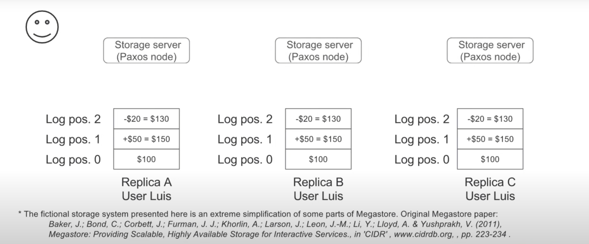
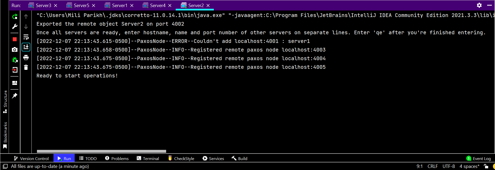
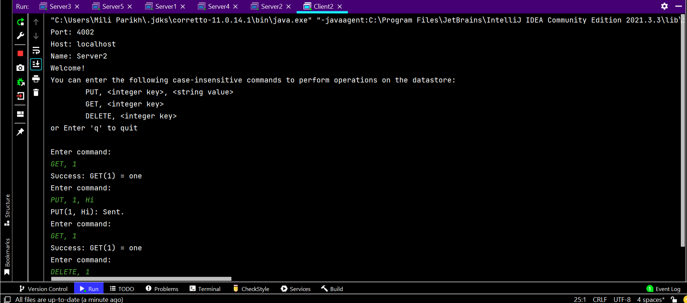

# Project 4 : Key-Value Store using PAXOS
By Mili Bimal Parikh

## Overview

The project includes a Key-Value store that accepts a string as the value and an integer as the key. 
A remote client can alter and query this data store by remotely invoking methods on the objects our 
server has bound to the registry. The server and client both make use of Java's RMI to support RPC. 
The server now supports the following 3 operations on the data store:

- `PUT, <key>, <value>` - Creates a new entry in the key-value store for the `key`, or, if the `key`
- is already present, changes the existing record with the new value.
- `GET, <key>` -  If the `key` is found in the key-value store, it returns its `value`.
- `DELETE, <key>` - Removes the entry related to the `key` from the key-value store, if there is such a `key` present.


The application lets you make as many servers as you want, and the client can connect to any of them.
The client can choose to call methods like PUT and DELETE on the server they are connected to. 
However, the application uses the PAXOS algorithm to manage the distributed database.

The goal of this project was to help learn more about how RPC and PAXOS work and to create a 
system that can handle failures. I think that this goal has been met. As I worked on this project, 
I quickly realized that we need to think about a lot of small things before we can come up with a 
solid solution. Putting together this project has given me a short taste of what it might be like 
to make complicated backends for apps that people actually use.

## Technical Impressions

Java and Java's RMI are used to build the project. After doing research on both RMI and Apache 
Thrift, I realized that Apache Thrift gives me much more flexibility, but this project doesn't need 
the fine-grained control that Thrift gives me. Because of this, I chose to use RMI, which is part 
of the JDK.

### PAXOS

#### The Consensus

- It's not possible to run PAXOS for some database value because we're not dealing with a single 
value, but with distributed databases.
- Instead, we can think of a database as a set of operations that were done in order to get it to 
where it is now.
- In my implementation, a "Log" keeps track of the "sequence" of these operations.
- Each entry in this log represents an action that was taken on the key-value store. If the same 
actions were taken in the same order, we would get a copy of the database that is exactly the same 
as the original.
- Because of this, it's important that this order is kept.
- Therefore, rather to just being concerned with what action should be executed, our PAXOS 
run is focused on reaching a consensus on what should be performed at a specific log position.
- Starting at location zero in our log, Each proposer proposes a log position's action. 
The log counter is increased by 1 if this proposal is accepted, and so on.


Log based consensus (src: [Google](https://www.youtube.com/watch?v=d7nAGI_NZPk&t=1s))

#### Proposer

- In my implementation, a `Proposer` entity talks to the client and makes proposals for 
consensus based on what are the requirements of the client.

- The `Proposer` is made up of two different parts: `ServerProposer` and `ClientProposer`.

- `ClientProposer` is the remote object that the client can access.
  The interface displays important functionality from our key-value store, like insert, remove, and get.

- `ServerProposer` shows how the proposer can get promises and follow through on them.

- When the client wants to do something like PUT or DELETE that changes the key-value store, 
it does so through the `ClientProposer`.

- The `ClientProposer` then asks the `ServerProposer` to make a proposal to run the actions and 
send it to all acceptors.

- For requests that only "read" from the key-value store, the `ServerProposer` communicates directly to 
the learner to query the required key.

- Once the proposer gets promises from a majority of the acceptors, it gets ready to send 
requests to accept to all the proposers.

- If a value is piggybacked on to the promise, the proposer asks all acceptors to accept the 
piggybacked value. If they don't, the proposer proposes the operation the user asked for.

- A proposal contains a unique, incrementing `proposalId`. This ID is made using UTC timestamps 
that are accurate to the nanosecond level. So, any proposal made after another proposal will 
always have a proposal ID that is higher.

#### Acceptor

- An `Acceptor` decides whether or not to take a proposal from a `Proposer`.

- When an `Acceptor` gets a proposal from a `Proposer`, it starts to work.

- If the proposal has the highest proposalId for the log position that the acceptor has seen, 
the acceptor makes a note of it and sends a promise back to the proposer. 
If it is not the highest proposalId it has seen, the acceptor does not answer the sender at all.

- It also checks to see if a proposal for the same log position has been accepted. 
If it has, the accepted value is added to the promise.

- Then, when the proposer sends a `AcceptRequest`, it checks again to see if that 
proposalId is still the highest it has seen. If the answer is yes, it makes a note of the 
accepted proposal and sends a confirmation to the learners.

- Inside the acceptor, a Map of proposals received for a log position is kept. It keeps 
putting the proposal in place of a log position if that is what is needed.

- The acceptor also keeps track of proposals that it has accepted, or proposals for which 
ACKs were sent to learners.

#### Learner

- Through acceptors, the `Learner` learns which actions are accepted and then runs the action 
on the key-value store.

- It runs the action on the key-value store once a majority of the acceptors for a log position 
have acknowledged it.

- For this, it keeps a ConcurrentHashMap on the inside that keeps track of the ACKs it has 
received for a certain log position.

- It then calls the `Operation`'s `execute` method and saves the "executed" operation in a map of 
executed operations so that the same operation can't be done twice.

#### NodePaxos

- Each node in our system is both an acceptor and a proposer as well as a learner. 

- "PaxosNode" is the interface that encapsulates these roles.

- In addition to the above features, it also allows other remote nodes to be added to a 
list of nodes that each node keeps so that nodes can communicate to each other.

## Running the Program

### Running the Server

- You can run the server by running `server.driver.ServerDriver` or the JAR file that goes with it.

- `ServerDriver` needs 3 arguments, which can come in any order:

- `-p <port>`: Port where the server's registry will start.

- `-n <name>`: Name of the remote object on the server.

- `-f <filepath>`: (optional) The path to the server's configuration file.

- Example:
```shell
java ServerDriver -p 4001 -n server1 -f res/start1.txt
```
To run the jar file:
```shell
java -jar serverdriver.jar -p 4001 -n server1 -f res/start1.txt
```
- `ServerDriver` will make one object of a remote server.

#### Steps to initialize multiple servers

- First, start up n copies of ServerDriver with the necessary command-line arguments.

- You'll see that each server requests information about remote servers' objects. 
At this point, don't make any client requests.

- This step is needed to let the servers know that other servers exist so that they can 
communicate with each other.

- Follow the steps and put "hostname, remoteName, port" on a new line for each server.

- Enter "qe" when you're done adding server information.

- Do the same thing for each copy of the server.

- You can now send requests to clients.


By creating a configuration file with the type `res/start1/txt` and then passing the filepath as 
a command-line parameter to the program as described above, you can avoid writing all of this 
information to the console.

### Running Client

- You can run the client by running `client.driver.RMIClientDriver` or the JAR file that goes with it.
- The client's driver can take three arguments on the command line:

  1. `-p <port number>`: the port that the server registry is accessible at.
     The port number must fall within the [1024, 65535] range.
  2. `-h <host name>`: server's host name
  3. `-n <name>`: binding name for `RemoteServer` object.

- Example:

```shell
java RMIClientDriver -n Server1 -p 4001 -h localhost
```
To run the jar file:
```shell
java -jar clientdriver.java -n Server1 -p 4001 -h localhost
```

### Using the program

The list of authorized commands is below. Case insensitivity applies to all commands.
The command's parameters are separated by commas (",").

1. `PUT, <key>, <value>`, example, `PUT, 1, Mili`
2. `GET, <key>`, e.g. `GET, 1`
3. `DELETE, <key>` e.g. `DELETE, 1`

Here, the keys must be valid integers. The values are strings.

Here, the keys should be integers. The values should be strings.

The server will try to respond with an error message that is as precise as possible to let the client
know what elements of the request are incorrect, but if that is not possible, it will respond with a
message indicating that the command was successfully executed.

The client will ask the user for input after starting up and print the results to standard output.
The client and server both keep thorough logs of requests, responses, and errors in an appropriately
labeled txt file created after executing the program in the same directory.

The server pre-populates the key-value store with the following keys:

- 1 -> One
- 2 -> Two
- 3 -> Three
- 4 -> Four
- 5 -> Five

To run the .jar files, navigate to /res.

- When you type a command on the client side, the server will ask you for more information.
- These prompts allow users to experiment with various input sequence ideas while strategically 
stopping the PAXOS algorithm's execution.
- You can re-enact scenarios when the acceptor didn't receive a proposal from the proposer, 
for example, if you decide to disregard a proposal.
- To imitate communication delays, simply pause for a time before accepting to the prompt.
- Please be aware that occasionally the logs may get in the way and prevent you from
seeing the input prompt at all.

### Example run

- The following example shows a client trying to PUT a key in a 5 server environment while being 
connected to server 2.




The client first sends the PUT command and then GETs the key to verify the execution of operation.

The contacted server receives the requests, creates a proposal, asks the user to send the proposal, 
receives promises and then sends ACKs as it got the majority.

A replica server's acceptor receives the proposal, asks the user to accept it, sends back promise, 
receives an accept request, then sends ack to learners, and as soon as the learner receives majority, 
it executes the operation.

To run the .jar files, navigate to /res.

## Example Commands

Following are some valid example commands that you can try:

- `PUT, 20, hello`
- `PUT, 51, crazy`
- `DELETE, 20`
- `GET, 51`
- `DELETE, 51`


## Assumptions

- That the remote registry works as expected. The remote objects are non-perishable.

## Limitations

- To simulate fail scenarios, it uses user input and therefore bulk operations cannot be performed 
at speed.

## Citations

- https://docs.oracle.com/en/java/
- https://www.youtube.com/watch?v=_EXvPCx7qnQ&t=130s
- https://www.javatpoint.com/log4j-properties
- https://betterstack.com/community/guides/logging/how-to-start-logging-with-log4j/
- https://medium.com/designing-distributed-systems/paxos-a-distributed-consensus-algorithm-41946d5d7d9
